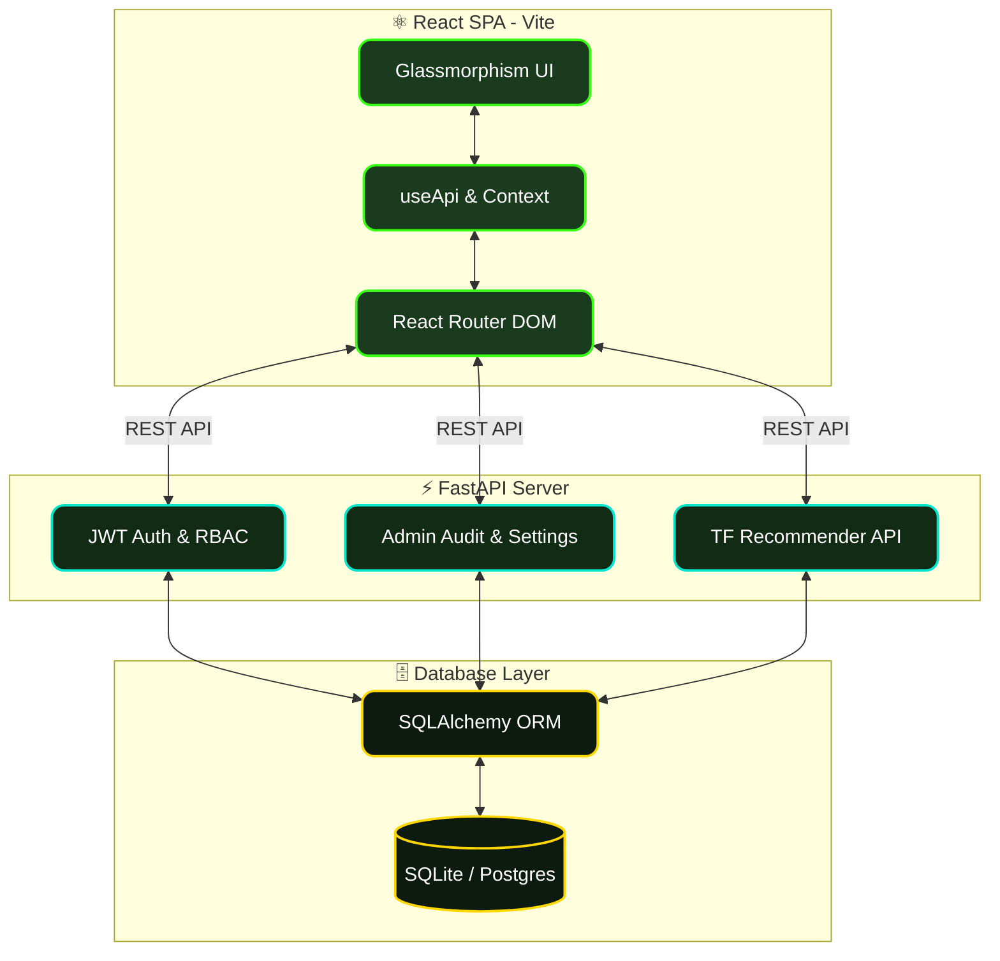

<div align="center">
  

  <h1>🌱 Carbon Guardian AI</h1>

  <p>
    <strong>Enterprise-Grade ML-Powered Sustainability Platform</strong>
  </p>

  <p>
    
    
    
    
    
  </p>

  <p>
    <a href="#-architecture">Architecture</a> •
    <a href="#-gamification-economy">Gamification</a> •
    <a href="#-ai-recommender-engine">AI Engine</a> •
    <a href="#-getting-started">Getting Started</a> •
    <a href="#-api-reference">API</a>
  </p>
</div>

---

## 🌍 Overview

**Carbon Guardian** is a full-stack, AI-driven sustainability platform designed to gamify ecological action and dynamically optimize user behavior using machine learning. Built with a stunning Glassmorphism UI and a robust FastAPI backend, it serves as a scalable prototype for enterprise ESG (Environmental, Social, and Governance) tracking.

### ✨ Key Features
- 🧠 **Intelligent Recommender Engine:** A TensorFlow-powered ML system that analyzes user logs to suggest high-impact ecological actions (e.g., Transit, Energy, Waste).
- 🕹️ **Gamification Economy:** An expansive RBAC-controlled reward system where administrators can dynamically tune points and thresholds in real-time.
- 🔮 **Glassmorphism Interface:** A highly polished React frontend using Framer Motion micro-interactions, dark mode aesthetics, and contextual skeleton loaders.
- 🛡️ **Enterprise Admin Suite:** Real-time metrics, interactive CSV data export, AI engine manual triggers, and full administrative audit logging.

---

## 🏗 System Architecture

Carbon Guardian employs a modular, decoupled architecture, separating the ML pipelines from the core business logic.



---

## 🧠 AI Recommender Engine

The core innovation of Carbon Guardian is its offline training pipeline and online inference engine.

1. **Telemetry Ingestion:** Every user action (logging a metro ride, recycling, solar power usage) is recorded in the `UserActivity` table.
2. **Batch Training:** The `/admin/ai/retrain` endpoint triggers a TensorFlow pipeline that ingests historical logs and fits a sequential model to predict optimal future actions for a user based on their demographics and recent history.
3. **Dynamic Scoring:** When the inference engine predicts an action, the backend queries the `GamificationSetting` table to dynamically attach live Green Points to the recommendation.

---

## 🕹 Gamification Economy

Carbon Guardian uses a dynamic economy rather than hardcoded point values. 

Administrators have access to the **Green Points Configuration** dashboard. They can tune the point values for actions like `Transportation`, `Electricity`, and `Food`. The entire application (from the live impact trackers to the ML recommender) dynamically queries these database tables, allowing real-time economic balancing without deploying code.

---

## 🚀 Getting Started

### 📋 Prerequisites
- **Node.js** (v18+)
- **Python** (3.10+)
- **Git**

### 1️⃣ Backend Setup

```bash
cd backend
python -m venv .venv

# Windows
.\.venv\Scripts\Activate.ps1
# Unix/Mac
source .venv/bin/activate

# Install dependencies
pip install -r requirements.txt

# Run migrations and seed the database
alembic upgrade head
python scripts/seed.py

# Start the server (runs on http://localhost:8000)
uvicorn app.main:app --reload
```

### 2️⃣ Frontend Setup

```bash
cd frontend
npm install
npm run dev
```

The frontend will run on `http://localhost:5173`. 
> 💡 **Default Admin Credentials:** `admin@carbonguard.com` / `devpassword123`

---

## 📚 API Reference

Carbon Guardian exposes a strictly typed, OpenAPI-documented REST backend. Once running, access the interactive Swagger UI at `http://localhost:8000/docs`.

### 🔐 Authentication
Most endpoints expect the JWT access token in an `access_token` cookie. The login endpoint uses JSON and sets this cookie automatically, so it doesn't return a token in the body.
```bash
curl -X POST "http://localhost:8000/auth/login" \
     -H "Content-Type: application/json" \
     -d '{"email": "admin@carbonguard.com", "password": "devpassword123"}' \
     -c cookies.txt
```

### 🤖 AI Recommendation
```bash
curl -X POST "http://localhost:8000/ai/recommend" \
     -b cookies.txt \
     -H "Content-Type: application/json" \
     -d '{"time_of_day": 12, "location_aqi": 100, "weather_temp": 30.5}'
```

### ⚙️ Gamification Admin Tuning
```bash
curl -X PUT "http://localhost:8000/admin/settings/gamification/1" \
     -b cookies.txt \
     -H "Content-Type: application/json" \
     -d '{"points": 15}'
```

---

## 🔒 Security & RBAC

The application employs Role-Based Access Control (RBAC). 
- 👤 **Standard Users:** Can access their profile, run personal simulations, and query the Recommender Engine.
- 👑 **Administrators:** Pass through the strict `get_current_admin_user` dependency. They can access `/admin/*` routes, trigger ML retraining, modify the economy, and view the `AdminAuditLog`.

---
<br />
<div align="center">
  <p><i>Built for the Planet. Built for the Future. 🌍</i></p>
</div>
